# my3dmaps

Turn real-world topography into multi-colour, 3D-printable landscape tiles
for the **Elegoo Centauri Carbon 2 Combo** (4 filament slots, 256 mm bed).
Pick an area and scale on a map, set the height exaggeration, preview the
coloured model, and export a multi-object 3MF (one object per colour) plus
per-colour STLs and a print plan. With OrcaSlicer's CLI configured it also
produces G-code.

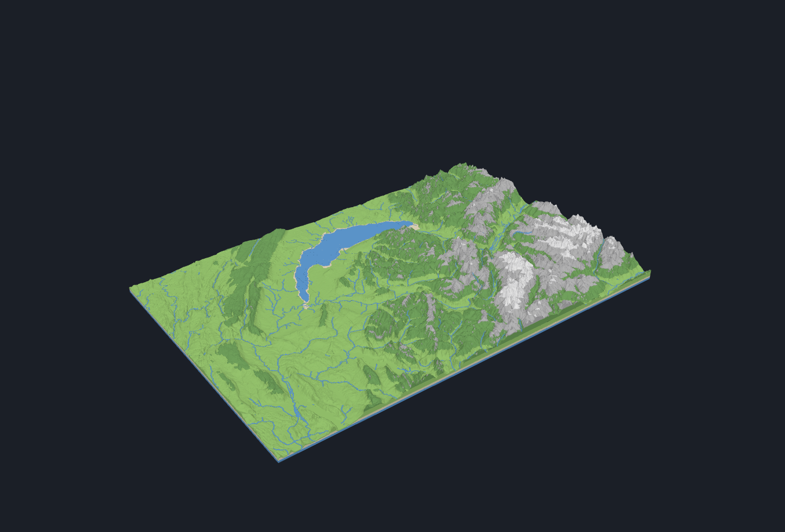

*Lake Geneva to the Mont Blanc massif: 3 × 2 tiles at 1:250,000, 2.5× height
exaggeration, six colours (water, shore, two vegetation tiers, rock, snow).*

## What it does

* **Data in:** NASA SRTM 1 arc-second elevation and Natural Earth lakes and
  coastline, both public domain. Rivers, and optionally built-up areas and
  major roads, come from OpenStreetMap (ODbL, credit required, can be
  switched off). See [SOURCES.md](SOURCES.md).
* **Tiles:** 200 × 200 mm modules on a shared grid, so any N × M set butts
  together seamlessly. Tiles are meant to be glued edge to edge; an optional
  shrinkage compensation keeps the cooled parts at nominal size.
* **Colours:** a config-driven, elevation-ordered palette. Bands that do not
  occur in a region are dropped automatically (Liverpool has no rock or snow).
  With more colours than slots the two least distinct bands are merged, or a
  manual mid-print swap is planned at the layer where a finished colour frees
  its slot.
* **Mesh:** every colour is a closed, watertight solid built so that each
  spool is loaded once and prints bottom to top. Flat faces are merged
  losslessly, which halves file sizes.
* **UI and CLI:** a local web app with a Leaflet picker and a live Three.js
  preview, and a headless command line for scripted builds.

## Gallery

### Liverpool and the Mersey, 1:50,000, 2 × 2 tiles

Low relief at 8× exaggeration. Rock and snow are pruned; the shore band
marks tidal flats. Rivers, canals and brooks are drawn from OpenStreetMap.

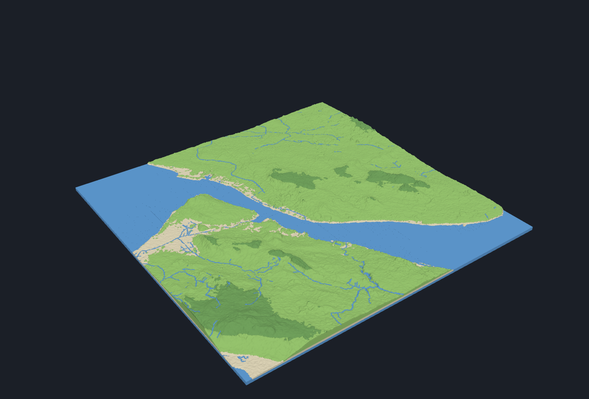

| tile_x0_y1 (north-west) | tile_x1_y1 (north-east) |
|---|---|
| 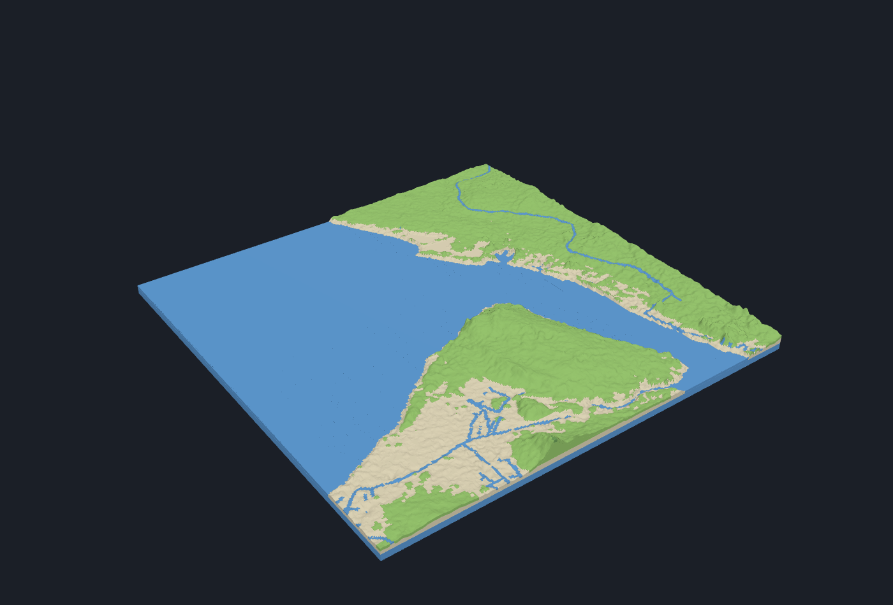 | 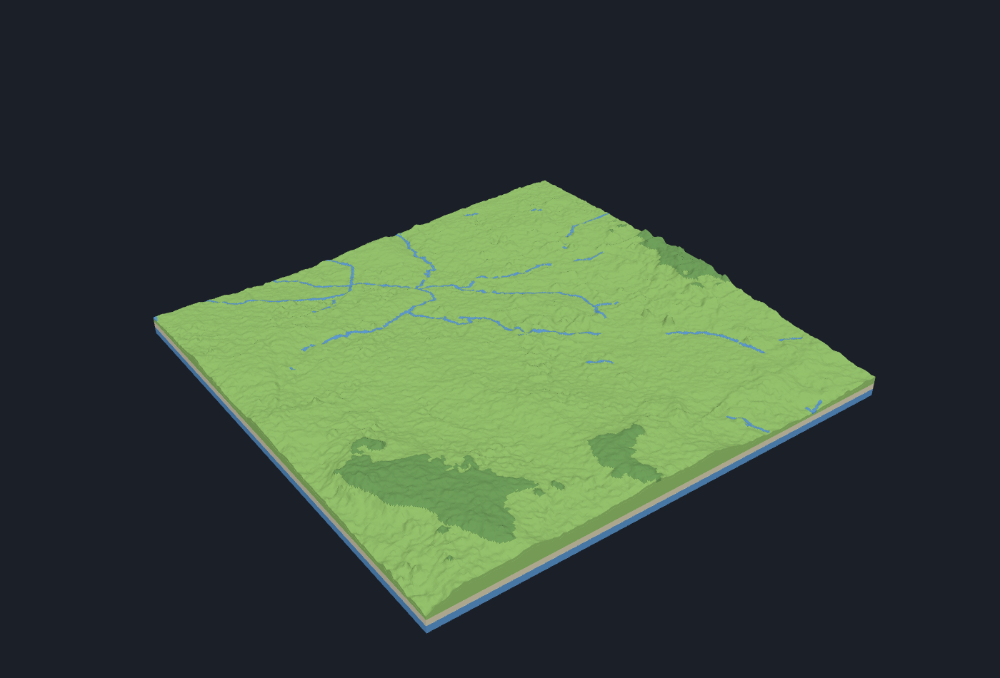 |
| **tile_x0_y0 (south-west)** | **tile_x1_y0 (south-east)** |
| 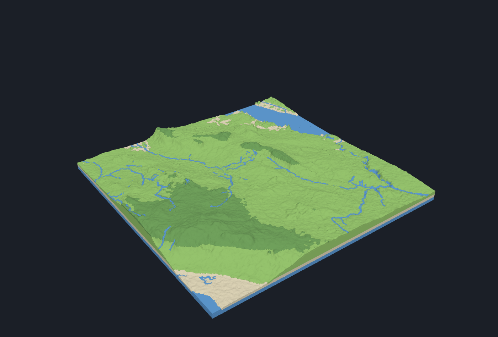 | 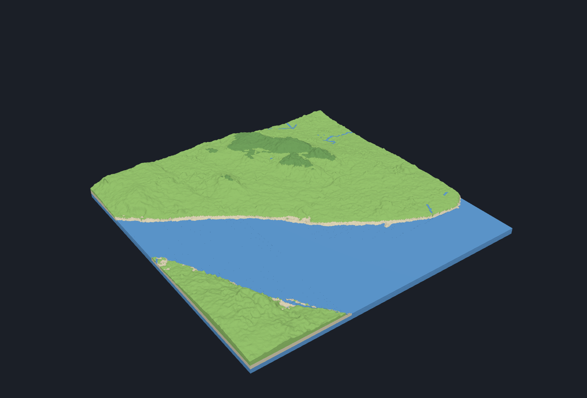 |

The same area with the optional **urban layer** switched on (built-up land
use and motorway/trunk/primary roads in dark grey):

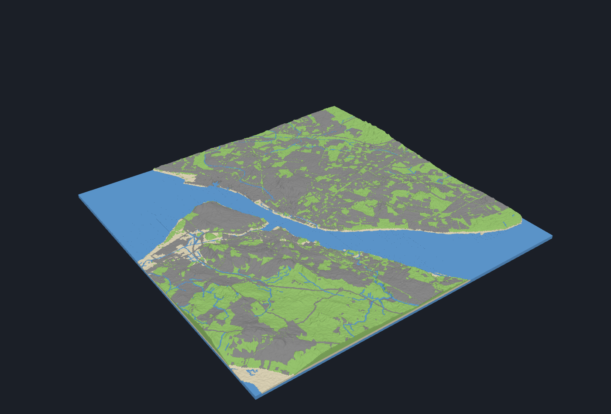

### Geneva to Mont Blanc, 1:250,000, 3 × 2 tiles

Six colours on four slots: the preset uses the manual-swap strategy, so the
tiles that reach the snowline pause once when the shore colour has finished
(shore → rock) and once more when lowland has finished (lowland → snow). The
lake surface is read from SRTM's flattened water and sits at 370 m.

| tile_x0_y1 | tile_x1_y1 | tile_x2_y1 |
|---|---|---|
| 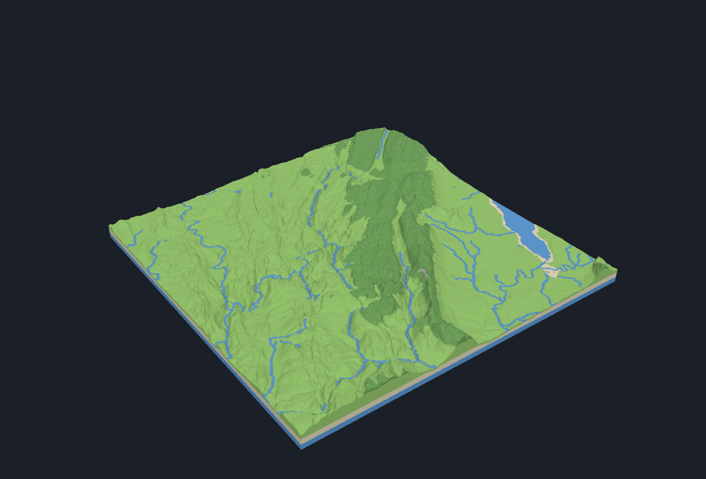 | 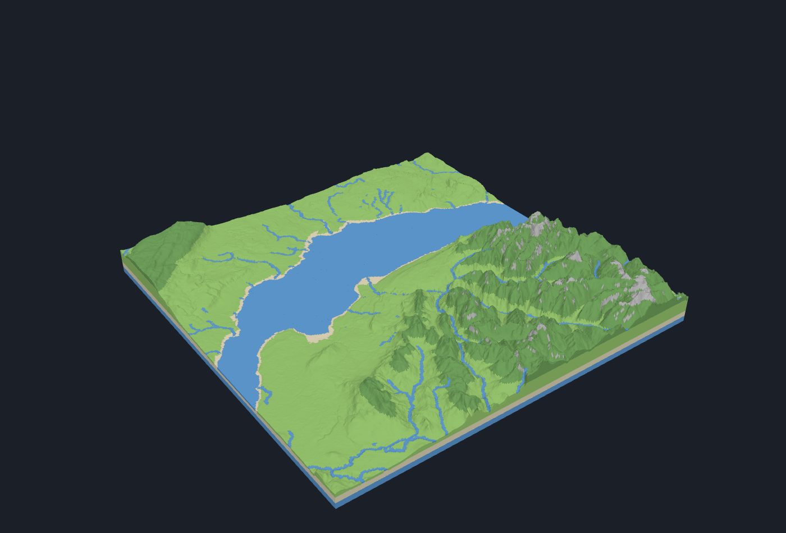 | 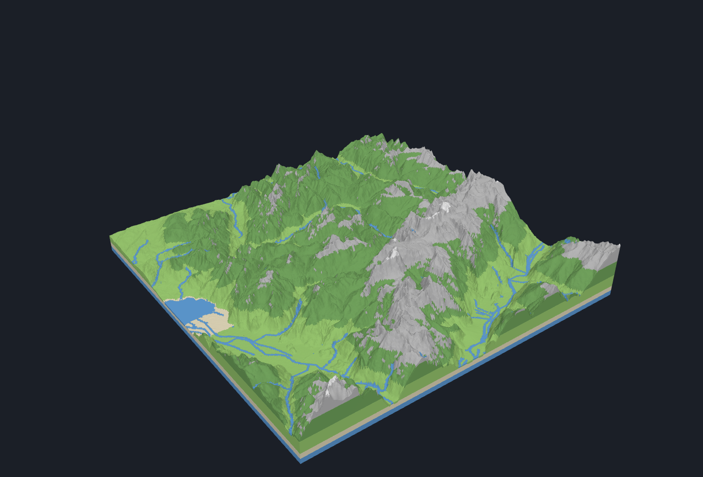 |
| **tile_x0_y0** | **tile_x1_y0 (Mont Blanc)** | **tile_x2_y0** |
| 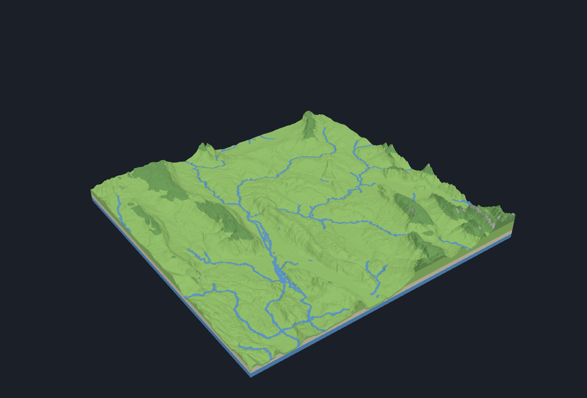 | 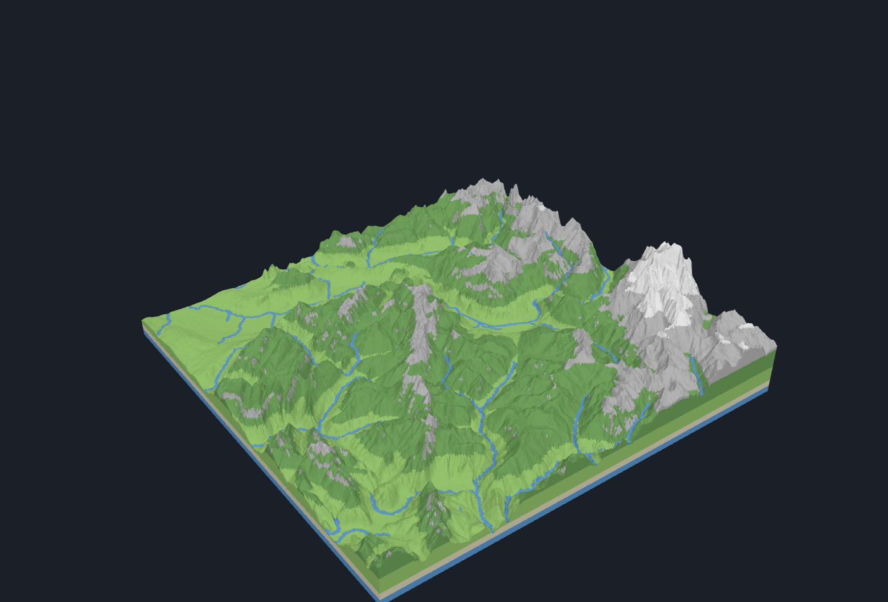 | 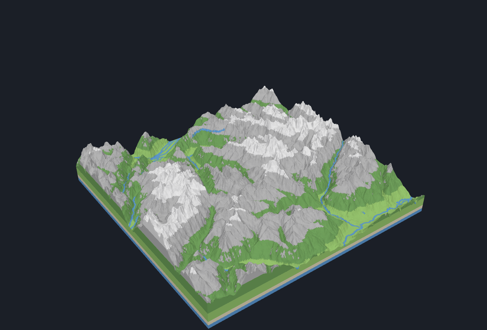 |

### Web UI

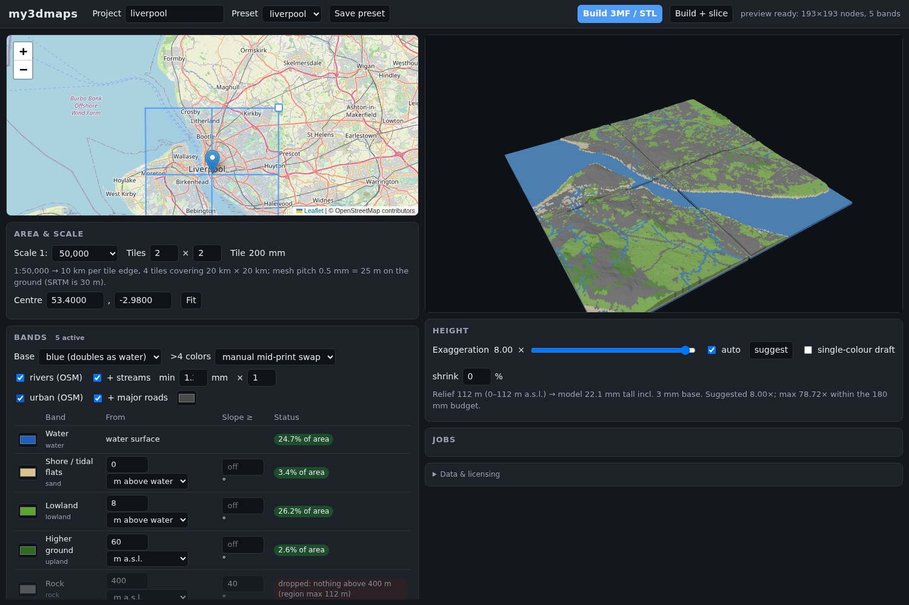

Drag the centre pin, drag the corner handle to change scale, edit band
thresholds and colours, toggle rivers and the urban layer, move the
exaggeration slider (the preview re-scales instantly), then build.

## Install

```bash
uv venv .venv && uv pip install -e ".[dev]"      # or: python -m venv .venv && .venv/bin/pip install -e ".[dev]"
source .venv/bin/activate
```

Pure-Python geospatial stack (numpy, scipy, shapely, pyproj, pyshp), no GDAL.
Python 3.11+. Data is downloaded on first use and cached under
`~/.cache/my3dmaps/` (override with `MY3DMAPS_CACHE`).

## Use

```bash
my3dmaps serve                          # web UI at http://127.0.0.1:8000
my3dmaps info  presets/geneva.json      # fetch data, report bands / relief / suggested exaggeration
my3dmaps build presets/liverpool.json --out out/liverpool        # 3MF + STL per tile, PRINT_PLAN.txt
my3dmaps build presets/geneva.json --out out/geneva --slice      # ... and run OrcaSlicer headlessly
my3dmaps slicer probe                   # check which CLI flags the installed slicer supports
my3dmaps slicer run out/geneva/tile_x0_y0 --dry-run              # print the slicer command for one tile
```

Overrides: `--scale 100000 --tiles 3x2 --exaggeration 2 --pitch 0.4 --shrinkage 0.3 --no-rivers --urban`.
Set `"monochrome": true` in a project (or tick *single-colour draft* in the UI) for a one-filament draft print.

### Output per tile (`out/<name>/tile_x<i>_y<j>/`)

* `tile_x0_y0.3mf`: one object per colour, with OrcaSlicer per-object extruder
  metadata and pause markers for manual swaps.
* `<band>.stl`: the same objects as separate STLs (input for the CLI slicer).
* `plan.json`: slot assignment, Z ranges, manual swap heights.
* `preview.glb`: coloured mesh for any glTF viewer (the renders above are made from these).
* `sliced/`: G-code and slicer log (with `--slice`).

`PRINT_PLAN.txt` at the project root lists slots, swap heights and the data
credits for every tile. The Mont Blanc tile of the Geneva preset:

```
--- tile_x1_y0 (height 49.8 mm) ---
  slot 1: water+base               #1f5fbf  z    0.0 -   23.5 mm
  slot 2: sand                     #d9c58c  z    3.0 -    6.0 mm
  slot 3: lowland                  #5aa62c  z    4.6 -   15.2 mm
  slot 4: upland                   #2f6b1e  z    9.3 -   22.9 mm
  slot 2: rock                     #8b8b8b  z   13.0 -   33.1 mm
  slot 3: snow                     #f4f4f4  z   28.6 -   49.8 mm
  MANUAL SWAP at z=13.0 mm: slot 2 #d9c58c -> #8b8b8b (sand -> rock)
  MANUAL SWAP at z=28.6 mm: slot 3 #5aa62c -> #f4f4f4 (lowland -> snow)
```

## Slicing (OrcaSlicer / Elegoo Slicer)

Export the machine (Elegoo Centauri Carbon 2), process and four filament
presets as JSON from the slicer GUI, then point the project at them:

```json
"slicer": {
  "executable": "/path/to/orca-slicer",
  "machine_preset": "presets/slicer/machine.json",
  "process_preset": "presets/slicer/process.json",
  "filament_presets": ["presets/slicer/pla_blue.json", "presets/slicer/pla_tan.json",
                       "presets/slicer/pla_green.json", "presets/slicer/pla_grey.json"]
}
```

The driver uses `--load-assemble-list` (per-band STLs merged into one
multi-part object, one filament per part), `--load-settings`,
`--load-filaments`, `--slice 0`, `--export-3mf`, `--outputdir`. Manual-swap
pauses are inserted into the G-code at the planned heights using the machine
preset's pause command (fallback `M601`). **This was written from the
OrcaSlicer sources, not verified against a live install**: run
`my3dmaps slicer probe` first. Without a slicer, `build --slice` still writes
the command it would have run to `sliced/slicer.log`.

## How the model is built

1. A UTM node grid for the whole tile set (shared borders, so tiles are seamless).
2. SRTM is sampled bilinearly onto the grid; voids are filled.
3. Natural Earth lakes and land polygons seed water bodies; each body's level
   is read from the DEM and the mask snaps to SRTM's flat water surfaces.
4. Elevation bands' lower thresholds become horizontal cutting planes; the
   solid under the surface is split into **slabs**, strictly bottom to top, so
   each colour prints in one contiguous Z range.
5. A **skin** (`skin_depth_mm`, 1.2 mm) on top carries the surface colour,
   which is where the non-elevation rules act: slope → rock, distance to water
   → shore, flat water → blue. **Rivers** are painted into this skin as a
   thinner blue layer (`rivers.depth_mm`, 0.6 mm) that follows the terrain,
   widened to at least `rivers.min_width_mm` (1.2 mm, about three lines of a
   0.4 mm nozzle) so even a brook prints. The optional **urban** overlay
   (`urban.enabled`, off by default) works the same way in dark grey.
6. Bands with no area are pruned. With more colours than slots, the two least
   distinct adjacent bands merge, or with `overflow: "swap"` a manual filament
   swap is planned where a finished colour's slot frees up. If the urban
   overlay has to go, its cells revert to the terrain underneath.
7. A plain square base plate. Set `shrinkage_pct` (e.g. 0.3 for PLA) to scale
   the footprint up so cooled tiles measure exactly `tile_mm`, unless the
   slicer's filament profile already compensates (do not do both).
8. **Lossless decimation.** Every exactly flat face (slab bottoms, slab tops
   clipped at the next threshold, lake surfaces) is covered by rectangles and
   fanned from a centre vertex, keeping every boundary node its neighbours
   use. Geometry is identical; Liverpool's per-tile STLs drop from 95 MB to
   50 MB and Geneva's whole project from 1 GB to 0.5 GB.
9. Export 3MF, STLs, GLB, plan.

## Configuration

A project is one JSON file (see `presets/`). The important fields:

| Field | Meaning |
|---|---|
| `center_lat`, `center_lon`, `scale`, `tiles_x`, `tiles_y` | Where, how big (1:`scale`), how many 200 mm tiles |
| `exaggeration` | Height multiplier; `null` picks one that gives ~45 mm of relief per tile |
| `base_mm`, `max_height_mm`, `pitch_mm` | Base plate thickness, height budget, mesh pitch on the print |
| `palette.bands[]` | Ordered bands with `color`, `from_m` or `from_water_m`, optional `slope_deg`, `max_distance_m`, `requires_water` |
| `palette.base_color`, `palette.overflow`, `palette.skin_depth_mm` | `blue`/`black`/`none`; `merge` or `swap`; skin thickness |
| `rivers` | `enabled`, `classes`, `stream_max_scale`, `min_width_mm`, `width_scale`, `depth_mm` |
| `urban` | `enabled` (default false), `landuse`, `roads`, `road_min_width_mm`, `color`, `depth_mm` |
| `shrinkage_pct` | XY scale-up for glued tiles (default 0) |
| `slicer` | Executable and exported preset paths |
| `monochrome` | One-filament draft print |

## Data and licensing

| Layer | Source | Licence |
|---|---|---|
| Elevation | NASA/USGS SRTM 1 arc-second v3 | Public domain |
| Lakes, coastline | Natural Earth 1:10m | Public domain |
| Rivers, urban layer | OpenStreetMap via Overpass | ODbL: credit "© OpenStreetMap contributors" on models that include them |

Untick rivers and urban (or `--no-rivers`) for a strictly public-domain
model. Details, citations and rejected alternatives are in
[SOURCES.md](SOURCES.md).

## Development

```bash
pytest              # offline: synthetic terrain, mesh watertightness, rivers, urban, planning, 3MF
pytest --network    # also hits the real SRTM / Natural Earth / Overpass services
python3 tools/render_tiles.py out/liverpool --out docs/images --prefix liverpool   # regenerate the images above
```

The render tool needs `pip install playwright && playwright install chromium`.
Design decisions and the implementation log live in [CLAUDE.md](CLAUDE.md).

## Status

Everything up to the 3MF/STL export is validated on real data for both
presets (closed shells checked independently with trimesh). The headless
slicer driver and the printer's pause command are the remaining pieces to
verify on a machine with OrcaSlicer installed.
